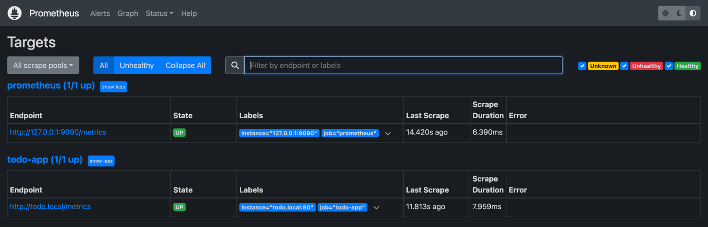
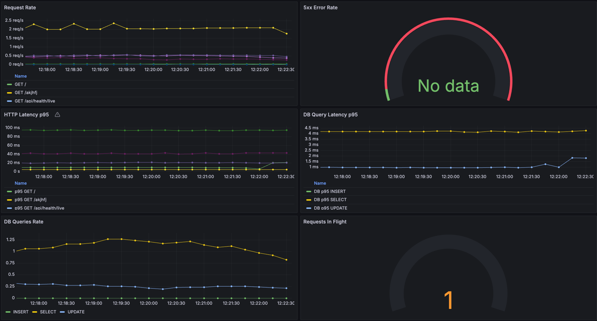
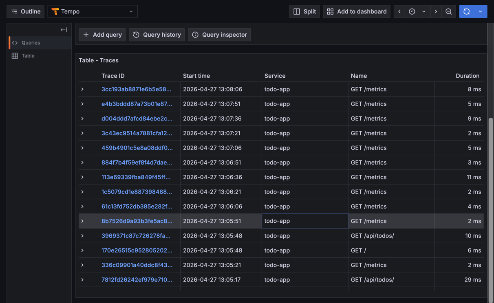

## Лабораторная работа №7

### Как воспроизвести

1. Поднять observability-стек:

```bash
cd todo-observability
docker compose up -d
```

2. Поднять приложение и отправить несколько запросов к API:

```bash
curl http://localhost:8080/api/health/
curl http://localhost:8080/api/stats
```

3. Открыть Grafana и проверить:
   - `Prometheus -> Status -> Targets` — jobs в статусе `UP`
   - `Explore -> Tempo` — появление trace по запросам к API
   - дашборд с метриками приложения

### Скриншоты






